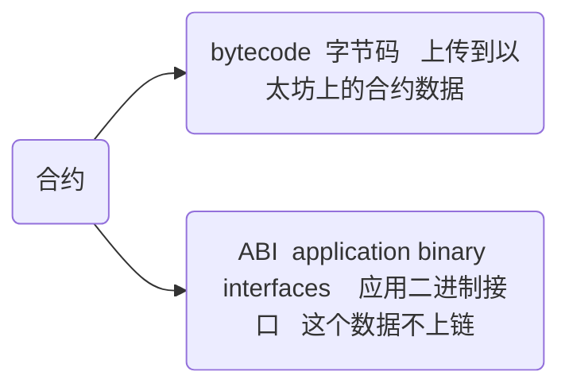
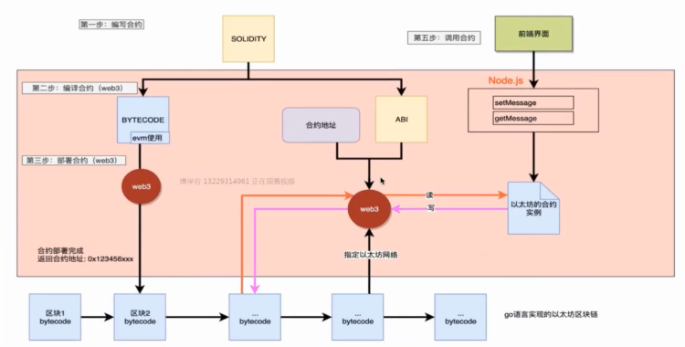

## 以太坊

#### 账户

- 外部账户（普通账户）
  - 由私钥控制
- 合约账户
  - 合约账户由外部账户控制
  - 合约账户可以接收钱
  - 部署一个合约会返回合约账户地址

#### 几个概念

gas

gaslimit 上限

gasprice(wei) * gas数量 = 手续费(eth) 

#### 交易结构

没有utxo

- nonce 随机数
- gasPrice
- gasLimit
- to
- value
- data 只附带消息的时侯赋值
- v,r,s, t~w~,t~r~ and t~s~ 和交易签名相关的变量，用于确定交易的发起者

| 对比项   | 比特币            | 以太坊      | 备注           |
| -------- | ----------------- | ----------- | -------------- |
| 出块时间 | 10分钟            | 15-30s      |                |
| 容量     | 1M                | gas数量决定 | 七百九十万左右 |
| 奖励     | 每四年衰减（12.5) | 目前是2个   |                |

## 智能合约

#### 定义

>“智能合约是一套以数字形式定义的承诺，承诺控制着数字资产并包含了合约参与者约定的权利和义务，由计算机系统自动执行。”
>
>“智能合约程序不只是一个可以自动执行的计算机程序，它本身就是一个系统参与者，对接收到的信息进行回应，可以接收和储存价值，也可以向外发送信息和价值。这个程序就像一个可以被信任的人，可以临时保管资产，总是按照事先的规则执行操作。”

#### 特点

- 合约由代码逻辑控制，且能触发支付
- 合约部署后存储在区块链上，且无法被修改
- 开发语言：solidity，类似javascript，专门开发的以太坊语言

注：**智能合约(smart contract)里面的智能并非人工智能的问题，而是灵活的意思，通过它可以创建一个功能丰富的合约**

 #### 合约账户

概述

- 由外部账户创建的智能合约实例，部署后返回一个地址，这个地址就是合约账户（有金额，有代码逻辑）
- 由外部账户发送消息激活合约账户的代码

合约本身是一个对象，部署后相当于创建一个实例，同一个合约可以部署多次，每次部署都创建一个新的合约账户，合约得到新的地址

1. 设置动作：改变区块链状态的动作是花钱的，需要确认的，
2. 读取动作： 读取数据的动作是免费的，是瞬间的

编译：



应用二进制接口： 用户调用合约方法 --> ABI -->通过交易调用合约

### solidity

#### 类型

- 值变量

  - 布尔

    - bool

  - 整型

    - int
    - uint
    - 以8位为区间，支持int8,int16,int24,至int256,uint同理，int默认int256,uint默认uint256

  - 地址(Address)

  - 定长字节数组(fixed byte arrays)

  - 有理数和整型(Rational and integer)

  - 枚举类型(Enums)

  - 函数(Function type)

    - 是一种特殊变量，可以当作变量赋值，当作参数传递，当作返回值

    - function 函数名 函数类型 返回值

    - ```solidity
      function getMessage() public view retutns(string) {
      	return message
      }
      ```

    - 匿名函数：没有函数名，没有参数，没有返回值的函数

      - 当调用不存在的方法时会默认调用匿名函数

      - 一般用来给合约转账，费用低

      - ```solidity
        function () public payable {
        
        }
        ```

- 引用变量
  - 不定长字节数组(bytes)
  - 字符串(string)
  - 数组
    - 内置数组
    - 自定义数组
  - 结构体
  - 字典/映射/hash表(mapping)

状态变量：定义在合约之内，但是在函数之外的变量，叫状态变量，这些变量会上传到区块链保存的


#### 修饰符：

1、函数和状态变量可见性修饰符

函数默认public， 状态变量默认private

- public:在外部和内部均可见（创建存储/状态变量的访问者函数）
- private:仅在当前合约中可见
- external: 只有外部可见（仅对函数）- 仅仅在消息调用中（通过this.fun）
- internal: 只有内部可见

注意：所有合约的东西对外部的观察者都是可见的，将某些东西标记为private,仅仅阻止了其他合约来进行访问和修改，但并不能阻止其他能看到相关信息

2、状态变量储存位置修饰符

- storage：变量储存在区块链中，状态变量默认是storage类型；
- memory：变量储临时存在内存中，局部变量默认是memory类型；

3、接受Ether修饰符

- payable：允许函数在调用同时接收Ether, 调用函数需要付钱，钱付给了智能合约的账户。

  ``` solidity
  // 向合约内转账
  pragma solidity ^0.4.24;
  
  contract Test {
     string public owner = "";
     
  // 如果构造函数中未指定payable关键字，那么创建合约时不能转账
  // 如果指定了payable，则可以转账
    constructor () payable public  {
    }
  
  function setOwner(string o) public payable {
      owner=o;
  }
  // 任何函数，只要指定了payable关键字，这个合约就接受转账，也可以转0
    function giveMoney() public payable {
      
    }
      function getbalance() public view returns(uint256) {
      // this代表当前合约
      // 获取当前合约账户的余额
          return address(this).balance;
      }
  }
  ```

  

4、函数读取状态变量修饰符

- pure：不允许修改或访问状态变量-这还没有强制执行

- view：不允许修改状态变量-这还没有强制执行

  ```solidity
  pragma solidity ^0.4.24;
  
  contract Test {
      uint256 i256 = 100;
      
      int8    ui10  = 10;
  
      function add() returns (uint256)  {  
          return i256 + uint256(ui10);
      }
      function isEqual() returns (bool) {
          return i256 == uint256(ui10);
      }
      function 
  }
  ```

  

  - 

- constant（for function）：等同于view

- constant（for state variables)：除了初始化之外，不允许赋值操作，类似JavaScript中的常量

5、自定义修饰符
函数修改器(Function Modifiers)

修改器(Modifiers)可以用来轻易的改变一个函数的行为。比如用于在函数执行前检查某种前置条件。
修改器是一种合约属性，可被继承，同时还可被派生的合约重写(override)。

OpenZeppelin库的Ownable 合约

下面是一个 Ownable 合约的例子： 来自 OpenZeppelin Solidity 库的 Ownable 合约。 OpenZeppelin 是主打安保和社区审查的智能合约库，你可以在自己的 DApps中引用。

所以Ownable 合约基本都会这么干：

合约创建，构造函数先行，将其 owner 设置为msg.sender（其部署者）
为它加上一个修饰符 onlyOwner，它会限制陌生人的访问，将访问某些函数的权限锁定在 owner 上。

#### 地址(Address)

以太坊地址长度，大小 20字节，20 *8 = 160位， 所以可以用uint160编码，地址是所有合约的基础，所有合约都会继承地址对象， 通过合约的地址字符串，调用合约内函数

运算符：<= <  == != >= >

操作：

| 属性/方法    | 含义             | 备注                 |
| ------------ | ---------------- | -------------------- |
| balance      | 获取余额         | 属性，其余的都是方法 |
| send         | 转账             | 不建议使用           |
| transfer     | 转账             | 建议使用             |
| call         | 合约内部调用合约 |                      |
| delegatecall |                  | 调底层代码，别用     |
| callcode     |                  | 调底层代码，别用     |

上面的这三个方法call、delegatecall、callcode都是底层的消息传递调用，最好仅在万不得已才进行使用，因为他们破坏了solidity类型的安全

- 余额

  返回指定地址的余额

  ```solidity
  pragma solidity ^0.4.24;
  
  contract Test {
      address public addr1 = 0x00dd870fa1b7c4700f2bd7f44238821c26f7392148;
  
    function add() public view returns(uint160) {
        return uint160(addr1)+ uint160(10);
    }
      function getbalance() public view returns(uint256) {
          return addr1.balance;
      }
  }
  ```

- 转账

  向谁转账，就是谁调用tranfer

  ```solidity
  pragma solidity ^0.4.24;
  
  contract Test {
      address public addr0 = 0x00dd870fa1b7c4700f2bd7f44238821c26f7392148;
      address public addr1 = 0x00dd870fa1b7c4700f2bd7f44238821c26f7392148;
  
  constructor() payable public {  
   }
  
    function add() public view returns(uint160) {
        return uint160(addr1)+ uint160(10);
    }
      function getbalance() public view returns(uint256) {
          return addr1.balance;
      }
      function getContractBalance() public view returns(uint256) {
          return address(this).balance;
      }
      function tranfer ()  public payable {
    // 1. 转账的单位是wei
    // 2. 1 ether = 10 ** 18（10的18次方）
    // 3. 向谁转账，就用谁调用transfer函数
    // 4. 花的是合约的钱
    // 5. 如果金额不足，transfer会抛出异常
     addr1.tranfer(10 * 10 ** 18);
      }
      }
  }
  ```

- send 

  使用方式与transfer一样，转账失败会返回false， 

#### 定长字节数组

solidity内置了一些数组的数据类型：完全只读

- bytes1, ..., bytes32,	 允许值以步长1递增
- byte默认是bytes1,byte是类型，bytes是类型，bytes1是内置数组
- bytes1只能存储1个字节，即8位的内容，bytes2只能存储2个字节，即16位的内容，以此类推
- 长度可以读取length
- 长度不可以修改
- 可以通过下标访问
- 内容不可以修改

支持运算

| 描述     | 符号              |
| -------- | ----------------- |
| 比较运算 | <= < == != >= >   |
| 位运算符 | & \| ^(异或)  -非 |
| 下标运算 | [0, n)  n表示长度 |

内置方法： length()   返回数组长度

存储方式：16进制ascii码

```solidity
pragma solidity ^0.4.24;

contract Test {
    bytes1 b1="h";
    bytes20 b10 ="hello, world";
    function getlength() public view returns(uint256) {
        return b10.length;
    }
    function setValue() public pure {
        
    }
    // 固定长度数组可以通过下标访问，
    // 只能读，不能写
    // 存储的时候是ascii存储
    function getValue(uint256 i) public view returns(byte) {
        return b10[i];
    }
}
```

#### 枚举类型

- 枚举类型是在solidity中一种用户自定义类型

- 枚举可以显式的与整形进行转换，但不能进行隐式转换，显式转换会在运行时检查数值范围，如果不匹配会引起异常
- 枚举类型至少有一名成员，枚举元素默认时uint8,当元素数量足够多时，会自动变成uint16,第一元素默认为0，使用超出范围的数值会报错

```solidity
pragma solidity ^0.4.24;

contract Test {
    enum Weekdays  {
        Monday, Tuesday, Wednesday, Thursday, Friday, Saturday, Sunday
    }
    
    Weekdays currentDay;
    Weekdays defaultDay = Weekdays.Sunday;
    
    function setDay(Weekdays _day)  public {
        currentDay = _day; 
    }
    function getDay() public view returns (Weekdays) {
        return currentDay;
    }
    function getDafultDay() public view returns(Weekdays) {
        return defaultDay;
    }
}
```

#### 不定长字节数组(bytes)

- 动态字节数组
- 引用类型（说明可以使用storage来修饰，进行引用传递，指针的效果）
- 支持下标索引
- 支持length、push方法(push方法会帮助分配空间的)
- 可以修改
- 以十六进制格式赋值
- 格外注意：对于bytes，如果不是用下标访问，那么可以不用先申请空间，直接赋值即可，或直接push


注意的坑：

旧版的remix可以直接在remix 中使用"hello, world"的形式给bytes赋值，新版本不允许，必须使用0x格式

```solidity
pragma solidity ^0.4.24;

contract Test {
    bytes public names;
    function getLen() public  view returns(uint256) {
        return names.length;
    }
    function setValue(bytes input) public {
        names = input;
    }
    function getByIndex(uint256 i) public view returns (byte) {
        return names[i];
   }
   function setlen(uint256 len) public {
       names.length = len;
   }
   function setValue2(uint256 i) public {
       names[i]='h';
   }
   function PushData() public {
       names.push("a");
   }
}
```

#### 字符串(string)

- 动态尺寸的utf-8编码字符串，是特殊的可变字节数组

- 引用类型，
- 不支持下标索引
- 不支持length、push方法
- 可以修改，须通过bytes转换

```solidity
pragma solidity ^0.4.24;

contract Test {
  string public name = "Lily";
  function nameBytes() public constant returns(bytes) {
      return bytes(name);
  }
  function nameLength() public constant returns(uint256) {
      return bytes(name).length;
  }
  function changeName() public {
      bytes(name)[0]='H';
      // name[0]=H Error 不支持下标索引
  }
  function changeLength()  public {
      bytes(name).length=15;
      bytes(name)[14]='x';
  }
}
```

#### 转换(byte1/bytes/string)

固定长度字节数组 --> 不定长字节数组          创建bytes空间，逐个复制

不定长字节数组 --> string         string(bytes) 直接转换

string --> 不定长字节数组        bytes(string) 直接转换

```solidity
pragma solidity ^0.4.24;

contract Test {
  bytes10 b10 = 0x68656c6c6f776f726c64; // hello,world
  // bytes bs10 = b10; //无法直接转换
  bytes public bs10 = new bytes(b10.length);
  
  // 固定字节数组转动态字节数组
  function fixedBytesToBytes() public  {
      for(uint i = 0 ; i < b10.length; i++) {
      			bs10[i] = b10[i];
      }
  }
  function BytesToString() public view  returns (string) {
      return string(bs10);
  }
  function stringToBytes(string str) public  view returns (bytes){
      return bytes(str);
  }
}
```

#### 数组

- 内置数组
  - string
  - bytes
  - bytes1 ... bytes32
- 自定义数组

定长数组：

-  类型T，长度K的数组T[K], 例如uint[10] numbers , byte[10] names, uint[10] numbers=[1, 2,3]

- 内容可变
- 长度不可变，不支持push方法
- 支持length方法

不定长数组

- 定义格式：T[], 例如bytes[] citys, string[] names;
- 内容可以修改
- 可以改变长度(仅限storage类型)， 支持length， push方法
- memory类型的不定长数组不支持length

#### 数据位置(Data location)

复杂类型，不同于之前的值类型，占的空间更大，超过256字节，因为它贝他们占用的空间更大，如数组(arrays)和数据结构(struct),它们在solidity有一个额外的属性，即数据的存储位置：memory和storage

- 内存(memory)
  - 数据不是永久存在的，存放在内存中，超过作用域后无法访问，等待被回收
  - 被memory修饰的变量是直接拷贝，即与上述的值类型传递方式相同
  - 对于引用类型数据，作为参数时默认是memory类型(值传递)
- 存储(storage)
  - 数据永久存在
  - 被shorage修饰的变量是引用传递，相当于传地址，新旧两个变量指向同一个内存空间，效率较高，两个变量之间有关联，修改一个，另一个同样被修改
  - 只有引用类型的变量才可以显式声明为storage
  - 修饰为storage类型的都是上链的
- 状态变量
  - 状态变量总是storage类型的，无法更改
- 局部变量
  - 默认是storage(仅限数据结构或数组、字符串)，但是可以声明未memory类型

```solidity
pragma solidity ^0.4.24;

contract Test {
    string public name="lily";
    uint256 public num = 10;
    function call1() public {
        setName(name);
    }
    
    //对于引用类型数据，作为参数时默认是memory类型(值传递)
    //function setName(string memory input) private {}
    function setName(string input) private {
        bytes(input)[0]='H';
        num=1;
    }
    function call2() {
        setName2(name);
    }
    // 想使用引用类型，可以明确指定为storage
    function setName2(string storage input) private {
                bytes(input)[0]='H';
        num=2;
    }
     //如果局部变量是数组、字符串或结构体类型，默认是storage类型
    function localTest() public {
    // string storage tmp = name;
        string tmp = name;
        num = 3;
        bytes(tmp)[0]="3";
    }
    // 也可以明确为memory类型
        function localTest1() public {
        string memory tmp = name;
        num = 3;
        bytes(tmp)[0]="3";
    }
}
```


#### 结构体

```solidity
pragma solidity ^0.4.24;

contract Test {
// 定义结构之后无分号，与枚举一致
    struct Student  {
        string name;
        uint age;
        uint score;
        string sex;
    }
    Student[] public Students;
    // 两种赋值方式
    Student  public stu1  = Student("lily", 18, 20, "girl");
    Student public stu2 = Student({name:"Ji米", age:10, score:123, sex: "boy"});
    function assign() public {
        Students.push(stu1);
        Students.push(stu2);
        stu1.name = "Lily";
    }
    // 现在不支持返回结构体类型
    // 使用圆括号阔起来的类型叫元组
    // 不可修改，可以容纳不同类型的数据
    function returnStudent() public view returns(string, uint, uint, string){
        return (stu1.name, stu1.age, stu1.score, stu1.sex);
    }
}
```

#### 字典/映射/hash表(mapping)

- 键key的类型允许除映射外的所有类型，如数组，合约，枚举，结构体，值的类型无限制

- 无法判断一个mapping是否包含某个key，因为它认为每一个都存在，不存在的返回0或false， 空值

- 映射可以被视作为一个哈希表，在映射表中，不存储键的数据，仅存储它的keccak256哈希值，用来查找值时使用

- 映射类型仅能用来定义状态变量，或者在内部函数中作为stronge类型的引用

- 不支持length

- ==key不支持string类型==

```solidity
pragma solidity ^0.4.24;

contract Test {
    // id => name
    mapping(uint => string) public id_names;
    constructor()  public {
    id_names[1]="lily";
    id_names[2]="jim";
    id_names[3]="Tom";
    }
    function getNameById(uint id) public view returns(string) {
        string memory name = id_names[id];
        return name;
    }
    function setNameById(uint id) public  returns(string) {
        id_names[id]="Hello";
    }
}
```


#### 构造函数

使用与合约同名的函数作为构造函数已经废弃，现在使用constructor关键字

#### 全局函数/变量

最重要的两个全局变量

- msg.sender

  每次和以太坊交互时都会产生一笔交易，这笔交易的执行人就是msg.sender,简而言之，谁调用的，msg.sender就是谁，每笔交易的msg.sender都可以不同，例如：

  1. 部署合约的时侯，msg.sender就是部署的账户
  2. 调用setMessage时，msg.sender就是调用账户
  3. 调用getMessage时，msg.sender就是调用账户

  msg.sender 可以与权限限制

  ```solidity
  pragma solidity ^0.4.24;
  
  contract Test {
      address public owner;
      uint256 a;
      address public caller;
      constructor() {
          owner = msg.sender;
      }
      function setValue(uint256 tmp ) {
          a =tmp;
          caller = msg.sender;
      }
  }
  ```

- msg.value

  我们在介绍payable关键字的时候说，如果函数修饰为payable,那么这个函数就可以接收转账，这笔钱通过remix.value输入框传递过来

  在转账操作中，这笔钱是通过调用一个函数从而长生一笔交易转入合约的，换句话说，是这笔交易附带了一笔钱，在合约中，每次转入的value是可以通过msg.value获取到的

  - 单位是wei
  - 有msg.value就必须有payable关键字

  ```solidity
  pragma solidity ^0.4.24;
  
  contract Test {
          mapping(address => uint256) public money;
      
      function pay() public payable {
          if (msg.value != 100 )  {
              throw;
          }
          money[msg.sender]=msg.value;
      }
      function getBalance() public view returns(uint256) {
          return address(this).balance;
          }
  }
  ```

  区块和交易的属性

  有一些特殊的变量和函数总是存在于全局命名空间中，主要用于提供关于块链的信息。

  块和事务属性

  - block.blockhash(uint blockNumber) returns (bytes32) 给定块的哈希 - 仅适用于256个不包括当前最新块
  - block.coinbase (address) 当前块矿工地址
  - block.difficulty (uint) 当前块难度
  - block.gaslimit (uint) 当前块gaslimit
  - block.number (uint) 当前数据块号
  - block.timestamp (uint) 当前块时间戳从unix纪元开始为秒
  - msg.data (bytes) 完整的calldata
  - msg.gas (uint) 剩余gas
  - msg.sender (address) 该消息（当前呼叫）的发送者
  - msg.sig (bytes4) 呼叫数据的前四个字节（即功能标识符）
  - msg.value (uint) 发送的消息的数量
  - now (uint) 当前块时间戳（block.timestamp的别名）
  - tx.gasprice (uint) gas价格的交易
  - tx.origin (address) 交易的发送者（全调用链）
  - msg的所有成员的值（包括msg.sender和msg.value）可以针对每个外部函数调用进行更改。 这包括对库函数的调用。
- 如果要使用msg.sender在库函数中实现访问限制，则必须手动提供msg.sender的值作为参数。
  

#### 错误处理

`assert(bool condition)`:
如果条件不满足，则抛出 - 用于内部错误。
`require(bool condition)`:
如果条件不满足，则抛出 - 用于输入或外部组件中的错误。
`revert()`:
中止执行并恢复状态更改

#### 修饰器(modifier)

修饰器可以可以用来轻易的改变一个函数的行为，比如在函数执行前检查某种前置条件，修饰器是一种合约属性，可被继承，同时还可被派生的合约重写，

定义的时候可以设置参数

_; 代表这个修饰器所修饰函数的代码

放到修饰函数后面

```solidity
pragma solidity ^0.4.24;

contract Test {
    address public owner;
    uint256 a;
    address public caller;
    constructor() {
        owner = msg.sender;
    }
    modifier onlyOwner {
        require(msg.sender == owner);
        _;
    }
    function setValue(uint256 tmp ) onlyOwner {
        a =tmp;
        caller = msg.sender;
    }
}
```

#### 两个单位

- 货币单位

  一个字面上的数字可以带有wei，finney，szabo或者以太网的后缀，可以在以太网的子目录之间进行转换，其中没有后缀的以太网货币号被假定为魏。 2 ether == 2000 finney评估为true。

  `uint a = 1 ether`

- 时间单位

  可以使用文字数字后的秒，分，小时，天，周和年份进行后缀转换，其中以秒为单位，以下列方式将单位视为天真的时间单位：

  1 == 1 seconds
  1 minutes == 60 seconds
  1 hours == 60 minutes
  1 days == 24 hours
  1 weeks == 7 days
  1 years == 365 days
  如果您使用这些单位执行日历计算，请小心，因为不是每年等于365天，甚至每天都没有24小时，因为闰秒。 由于无法预测闰秒的事实，必须由外部的oracle更新精确的日历库。

  这些后缀不能应用于变量。

#### 事件(Event)

相当于打印log，但是需要在调用端才能看到，web3调用时演示

```solidity
pragma solidity ^0.4.24;

contract Test {
        mapping(address => uint256) public money;
    
    // 定义一个事件
    event playEvent(address, uint256, uint256);
    
    function pay() public payable {
        if (msg.value != 100 )  {
            throw;
        }
        money[msg.sender]=msg.value;
        // 需要使用emit关键字
    emit    playEvent(msg.sender, msg.value, block.timestamp);
    }
    function getBalance() public view returns(uint256) {
        return address(this).balance;
        }
}
```

#### 访问函数(Getter Function)

编译器为自动为所有的`public`的状态变量创建访问函数。下面的合约例子中，编译器会生成一个名叫`data`的无参，返回值是`uint`的类型的值`data`。状态变量的初始化可以在定义时完成

```solidity
pragma solidity ^0.4.0;


contract C{
    uint public c = 10;
}

contract D{
    C c = new C();
    
    function getDataUsingAccessor() returns (uint){
        return c.c();
    }
}
```

访问函数有外部(external)可见性。如果通过内部(internal)的方式访问，比如直接访问，你可以直接把它当一个变量进行使用，但如果使用外部(external)的方式来访问，如通过`this.`，那么它必须通过函数的方式来调用。

```solidity
pragma solidity ^0.4.0;


contract C{
    uint public c = 10;
    
    function accessInternal() returns (uint){
        return c;
    }
    
    function accessExternal() returns (uint){
        return this.c();
    }
}
```

在`acessExternal`函数中，如果直接返回`return this.c;`，会出现报错`Return argument type function () constant external returns (uint256) is not implicitly convertible to expected type (type of first return variable) uint256.`。原因应该是通过外部（external）的方式只能访问到`this.c`作为函数的对象，所以它认为你是想把一个函数转为`uint`故而报错。

#### 合约

- 创建合约

  两种方式

  1. new 关键字，返回值是address，需要显示转化类型后才能使用
  2. C c1形式，此时c1是空的，需要赋值地址才能使用，否则报错

  ```solidity
  pragma solidity ^0.4.24;
  
  contract C1 {
      uint256 public value ;
      constructor (uint256 input){
          value = input;
      }
      function getValue() public returns(uint256) {
          return value;
      }
  }
  contract C2{
      C1 public c1; //0x0000000000000
     C1 public c2; //0x00000000000
        C1 public c3; //0x0000000000
      
      function getValue() public   returns(uint256) {
          // 创建一个合约，返回地址
          address addr1 = new C1(10);
          // 需要在显示的转换为特定类型才能使用
          c1 = C1(addr1);
          return c1.getValue();
      }
      function getValue2() public returns(uint256) {
      // 定义合约的同时进行类型转换
          c2 = new C1(20);
          return c2.getValue();
      }
  
      function getValue3(address addr) public  returns(uint256) {
          c3 = new C1(30);
          return c3.getValue();
      }
      
  }
  ```

  合约间如何转钱

  ```solidity
  pragma  solidity ^0.4.24;
  contract InfoFeed {
  	function info() public payable returns(uint ret) {
  		return 42;
  	}
  }
  contract Consumer {
  	InfoFeed feed;
  	constructor()  public payable{
  	    
  	}
  	function setFeed(address addr) public {
  		feed = InfoFeed(addr);
  	}
  	function callFeed() public {
  		feed.info.value(10).gas(800)();// 10为转账到feed合约，800为上限
  	}
  	function pay() public payable {
  	    
  	}
  	function getBalance() public view returns(uint256) {
  	    return address(this).balance;
  	}
  }
  ```

  #### 元组(tuple)

  return (a, b, c)

  solidity无法返回自定义结构体，所以若想返回一个自定义结构的数据，需要在函数中一次返回多个值，即元组。

  元组是一个数据集合，类似于字典但是无法修改数据，使用圆括号包括多种数据类型

  - 可以包含多个数据
  - 类型可以不同
  - 不可以修改
  - 使用圆括号包裹

  #### 数学与加密功能

  addmod(uint x, uint y, uint k) returns (uint)
  计算（x + y）％k，其中以任意精度执行加法，并且不在2 ** 256处围绕

  mulmod(uint x, uint y, uint k) returns (uint)
  计算（x * y）％k，其中乘法以任意精度执行，并且不会在2 ** 256处循环。

  keccak256(...) returns (bytes32)
  计算的（紧凑）参数的Ethereum-SHA-3（Keccak-256）的散列

  sha256(...) returns (bytes32)
  计算（紧密包装）参数的SHA-256散列

  sha3(...) returns (bytes32)
  keccak256的别名

  ripemd160(...) returns (bytes20)
  计算（紧密包装）参数的RIPEMD-160哈希值

  ecrecover(bytes32 hash, uint8 v, bytes32 r, bytes32 s) returns (address)
  从椭圆曲线签名中恢复与公钥相关的地址，或者在错误时返回零（示例使用）

  在上面，“紧密包装”意味着参数是无连接的连接。 这意味着以下内容完全相同：

  keccak256("ab", "c")
  keccak256("abc")
  keccak256(0x616263)
  keccak256(6382179)
  keccak256(97, 98, 99)

  如果需要填充，可以使用显式类型转换：keccak256("\x00\x12") 与keccak256(uint16(0x12))相同。

  请注意，常量将使用存储它们所需的最少字节数来打包。 这意味着，例如keccak256(0) == keccak256(uint8(0))和keccak256(0x12345678) == keccak256(uint32(0x12345678))

  这可能是你在一个私人的块上遇到了sha256，ripemd160或ecrecover的Out-of-Gas。 这样做的原因是那些被实现为所谓的预编译合同，这些合同在收到第一条消息之后才真正存在（尽管他们的合同代码是硬编码的）。 对非现有合约的消息更昂贵，因此执行将会进入“Out-of-Gas”错误。 这个问题的解决方法是首先发送例如 在您将实际合同中使用这些合约之前，每个合约1 Wei。 官网或测试网不是问题。

#### 继承

- is 关键字

- 如果两个父约含有相同方法，默认为最远继承原则

- 多个继承间使用逗号分隔

- 可以指定父合约，使用特定的方法  合约名.方法名

```solidity
pragma solidity ^0.4.24;

contract Base1 {
	function data() public view returns(uint8) {
		return 1;
	}
}
contract Base2 {
	function data() public view returns(uint8) {
		return 2;
	}
}
contract son1  is Base1, Base2{
	function getData() public returns(uint8) {
		return data();//2
	}
		function getData() public returns(uint8) {
		return Base1.data();//1
	}
}
contract son2  is Base2, Base1{
	function getData() public returns(uint8) {
		return data();//1
	}
		function getData() public returns(uint8) {
		return Base2.data();//2 
	}
}
```

#### delete

- delete 可以用于任何变量，将其置为默认值
- 如果对动态数组delete，则删除所有元素，长度为0
- 如果对静态数组使用delete，则重置索引的所有值
- 如果mapping使用delete，则什么都不会发生
- 但如果对mapping中的某个键执行delete，则会删除该键相关的值

delete 变量名

### web3

- web3-eth 

  与blockchain和合约相关的模块

- web3-shh

  - 与p2p协议广播相关

- web3-bzz

  - 与swarm存储协议相关

- web3-utils

  - 开发者工具相关

### 部署合约



- ```
  new web3.eth.Contract(jsonInterface[, address][, options])
  ```

  Creates a new contract instance with all its methods and events defined in its [json interface](https://web3js.readthedocs.io/en/v1.2.6/glossary.html#glossary-json-interface) object.

  ### Parameters

  1. `jsonInterface` - `Object`: The json interface for the contract to instantiate

  2. `address` - `String` (optional): The address of the smart contract to call.

  3. - `options` - `Object` (optional): The options of the contract. Some are used as fallbacks for calls and transactions:

       `from` - `String`: The address transactions should be made from.`gasPrice` - `String`: The gas price in wei to use for transactions.`gas` - `Number`: The maximum gas provided for a transaction (gas limit).`data` - `String`: The byte code of the contract. Used when the contract gets [deployed](https://web3js.readthedocs.io/en/v1.2.6/web3-eth-contract.html#contract-deploy).

  ### Returns

  `Object`: The contract instance with all its methods and events.

  - 部署合约的时候需要用到，提供abi即可，执行后面动作进行部署，

  - 获取合约实例的时候需要用到这个函数，指定abi，指定address